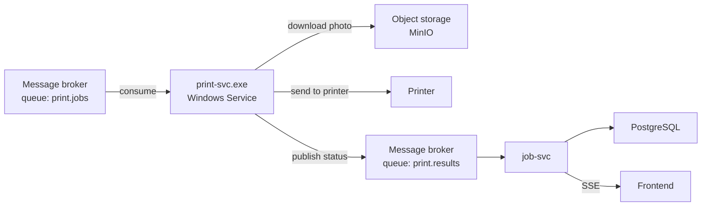

# print-svc

Windows service that consumes print jobs from the broker, sends them to the printer and reports status back.

## Role in the architecture



## Requirements

- .NET 8 SDK
- Windows 10/11
- RabbitMQ accessible on `localhost:5672` (via Docker)
- MinIO accessible on `localhost:9000` (via Docker)
- A printer installed on the machine

> RabbitMQ and MinIO are managed by [stand-infra](https://github.com/Association-Ephemere/stand-infra). Run docker compose up there first.

## Configuration

Create an `appsettings.local.json` file at the root (not committed):

```json
{
  "Broker": {
    "Host": "localhost",
    "Port": 5672,
    "Username": "guest",
    "Password": "guest",
    "JobsQueue": "print.jobs",
    "ResultsQueue": "print.results"
  },
  "Storage": {
    "Endpoint": "localhost:9000",
    "AccessKey": "minioadmin",
    "SecretKey": "minioadmin",
    "Bucket": "photos",
    "TempDirectory":  "./tmp/",
    "UseSSL": false
  },
  "Printing": {
    "PrinterName": ""
  }
}
```

`PrinterName` empty = system default printer.

## Run in development

```bash
dotnet run --project src/PrintSvc
```

## Run tests

```bash
dotnet test
```

## Install as Windows Service

```powershell
dotnet publish src/PrintSvc -c Release -r win-x64 --self-contained -o ./publish
sc create PrintSvc binPath="C:\path\to\publish\PrintSvc.exe"
sc start PrintSvc
```

## Message contracts

### Consumed — `print.jobs`

```json
{
  "jobId": "uuid",
  "photos": [
    {
      "photoStorageKey": "string",
      "copies": 1
    }
  ],
  "startFromIndex": 0
}
```

### Published — `print.results`

```json
{
  "jobId": "uuid",
  "status": "queued|printing|requeued|done|error",
  "printed": 123,
  "total": 456,
  "error": "string|null"
}
```

## Contributing

See [CONTRIBUTING.md](CONTRIBUTING.md)
